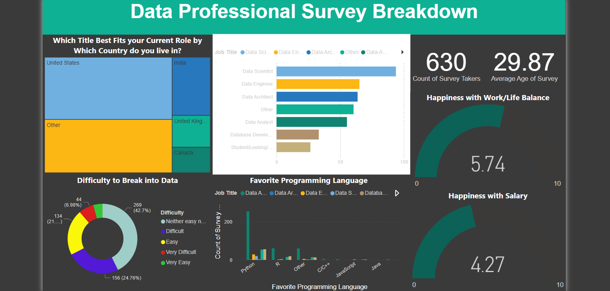

# DataProfessional-Survey-Insights

## 🔍 **Project Overview**  
This project features an interactive Power BI dashboard that visualizes key insights from the **Data Professional Survey**. The dataset was cleaned and transformed using **Power Query**, and an interactive, user-friendly dashboard was built to highlight important trends, statistics, and metrics related to data professionals.  

## 🎯 **Objectives**  
- Clean and prepare raw survey data using Power Query.  
- Create a dynamic and interactive dashboard using Power BI.  
- Provide insights into key aspects of the data professional community.  

## 🛠️ **Tools & Technologies**  
- **Power BI**: For visualization and dashboard creation.  
- **Power Query**: For data cleaning and transformation.  
- **Excel**: Used for raw dataset handling.  

## 📈 **Key Insights**  
### **Key Insights for the Data Professional Survey Dashboard**  

### 📊 **1️⃣ Most Popular Job Roles in Data Industry**
- **Insight**: The most common job roles among data professionals are **Data Analysts, Data Scientists, and Business Intelligence Analysts**.  
- **Impact**: This highlights the growing demand for roles related to data analysis and insights, which can guide job seekers on which roles to focus on.  

### 📊 **2️⃣ Key Technical Skills in Demand**
- **Insight**: The most in-demand technical skills for data professionals are **SQL, Python, and Power BI**.  
- **Impact**: This indicates that candidates seeking roles in the data field should prioritize learning these tools to increase employability.  

### 📊 **3️⃣ Salary Trends Across Job Roles**
- **Insight**: **Data Scientists and Machine Learning Engineers** earn the highest salaries among data professionals, while entry-level roles like **Data Analysts** have relatively lower salaries.  
- **Impact**: This information is useful for career planning, as it helps individuals understand the earning potential of different roles.  

### 📊 **4️⃣ Educational Background of Data Professionals**
- **Insight**: A large percentage of data professionals have degrees in **Computer Science, Data Science, and Statistics**.  
- **Impact**: This reveals the most common educational backgrounds for people in data roles, which is useful for students planning their academic path.  

### 📊 **5️⃣ Work Experience & Seniority**
- **Insight**: Most survey respondents have **2-5 years of experience**, while senior positions are held by those with over **7+ years of experience**.  
- **Impact**: It shows the importance of work experience in moving up to higher-paying, senior-level roles.  

### 📊 **6️⃣ Tools & Software Usage**
- **Insight**: Tools like **Power BI, Tableau, and Excel** are frequently used for data visualization, while **SQL, R, and Python** are commonly used for data analysis.  
- **Impact**: It showcases which tools are essential for data professionals and helps learners focus on relevant tools for their career development.  

### 📊 **7️⃣ Remote Work Trends**
- **Insight**: A significant portion of data professionals work **remotely or in hybrid roles**, with remote work becoming increasingly popular post-pandemic.  
- **Impact**: This indicates that the data industry is adapting to flexible work environments, allowing professionals to explore remote job opportunities.  

### 📊 **8️⃣ Preferred Industries**
- **Insight**: Data professionals are primarily employed in **Finance, Technology, and Healthcare** sectors.  
- **Impact**: This helps job seekers understand which industries offer the most opportunities for data-related roles.  

## 📁 **Project Files**  
- **Data Professional Dashboard.pbix**: The main Power BI dashboard file.  
- **Data Professional Survey Dataset.xlsx**: The raw dataset file.  

## 📸 **Dashboard Preview**  
Here’s a preview of the interactive Power BI dashboard:  

  

*Note: For a full interactive experience, download the `.pbix` file and view it in Power BI Desktop.* 

## 🚀 **How to Use**  
1. Clone this repository to your local machine.  
2. Open **Data Professional Dashboard.pbix** in Power BI Desktop.  
3. Explore the dashboard, interact with filters, and gain valuable insights.  

## 📚 **How I Built This**  
1. **Data Cleaning**: Cleaned and transformed the raw dataset using Power Query.  
2. **Data Modeling**: Created relationships between tables to enable cross-filtering.  
3. **Dashboard Design**: Built an intuitive and visually appealing dashboard with slicers, cards, and charts.  

## 💡 **Learning Outcomes**  
- Improved skills in **Power Query** and **Power BI**.  
- Gained experience in **data visualization** and **dashboard design**.  
- Learned how to draw actionable insights from raw data.  
